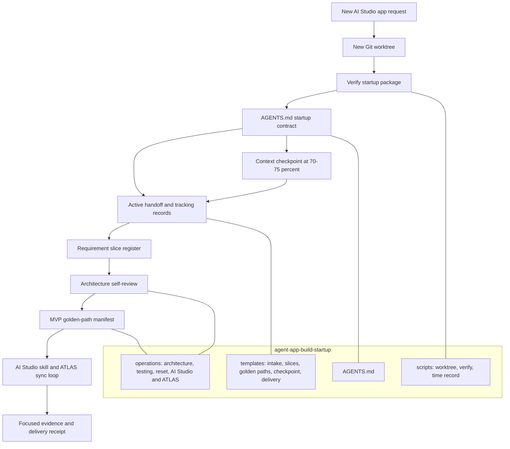

# Agent-App Build Startup Package

Machine bootstrap package for a new AI Studio agent-app build.

## Why developers use it

Use it to turn an agent-app build from a series of rediscovered decisions into
a controlled, auditable delivery flow. Isolated worktrees protect customer work
from unrelated state, while explicit MVP requirements, golden paths, ATLAS next
actions, and accuracy, completeness and timing evidence reduce tangential testing, rework, and late surprises.

## Structure

## Install contract

For installation into an unconfigured repository, follow the ZIP's INSTALL.md to activate its generated repository-seed, merge governance and commit it. Generate distributions with the repository packaging script; do not treat an old generated seed or ZIP as newer than the canonical source.

For an already configured repository, follow [the startup contract](AGENTS.md): read the handoff first, select new/retry versus resume, initialize records before the current-task Startup gate, and verify in the target checkout. Do not reinstall the seed or copy historical acceptance into a new receipt. The source model indexes in docs/build-models/ select the current prompt and plan; published ZIPs require a separate rebuild and verification before distribution.

## Rollback and uninstall

Use [Rollback and uninstall](docs/operations/ROLLBACK_UNINSTALL.md) before
installation to capture a recoverable baseline, and when reversing a failed
install, root activation or upgrade. Folder removal and root activation reversal
are separate steps; retain project work and recovery evidence.

## Package boundaries

- Canonical lifecycle policy: target repository playbook.
- AI Studio and ATLAS rules: target repository `.agents/skills/aistudio/`.
- This package: startup isolation, tracking shapes, MVP test guardrails,
  context-reset protocol, and verification of its own required files.

See [carry-forward inventory](docs/operations/CARRY_FORWARD_INVENTORY.md) for every
included dependency and [project structure](docs/operations/PROJECT_STRUCTURE.md)
for project-specific paths and excluded runtime state.

## Naming contract

The packaged `AGENTS.md` carries the repository-wide XDX convention for every
new Agent Studio artifact, local artifact file, build branch, and worktree. The
startup verifier fails if the required code, display-name, filename, branch,
or worktree markers are missing.
