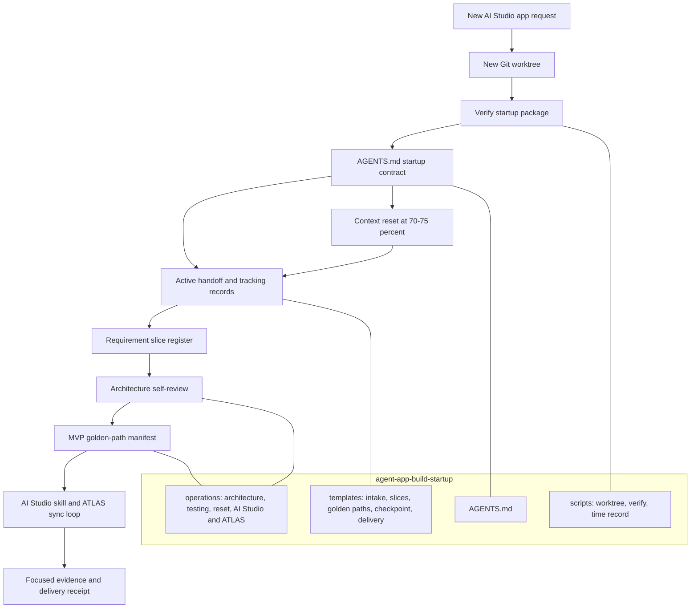

# Agent-App Build Startup Package

Machine bootstrap package for a new AI Studio agent-app build.

## Why developers use it

Use it to turn an agent-app build from a series of rediscovered decisions into
a controlled, auditable delivery flow. Isolated worktrees protect customer work
from unrelated state, while explicit MVP requirements, golden paths, ATLAS next
actions, and cost evidence reduce tangential testing, rework, and late surprises.

## Structure

## Install contract

1. Follow the ZIP's `INSTALL.md` to install this package and activate its generated
   `repository-seed/`. A source-template checkout has no generated seed: build the
   install ZIP with the repository's packaging script first.
2. Merge root governance, fill the handoff and intake records, and verify the
   living-build contract before an app build. The seed root `AGENTS.md` supplies
   the lifecycle entrypoint; this package's `AGENTS.md` supplies startup mechanics.
3. Commit the activated files and this package so new worktrees inherit them.
4. Create a new worktree using `scripts/New-AgentAppBuildWorktree.ps1` from that
   committed base. Start a fresh Codex run, read its active handoff first, and run
   the living-build and startup verifiers there.
5. Materialize `templates/` in `docs/builds/<build-id>/`, except
   `active-handoff.md`, which belongs at `docs/handoffs/ACTIVE_HANDOFF.md`.

## Rollback and uninstall

Use [Rollback and uninstall](docs/operations/ROLLBACK_UNINSTALL.md) before
installation to capture a recoverable baseline, and when reversing a failed
install, root activation or upgrade. Folder removal and root activation reversal
are separate steps; retain project work and recovery evidence.

## Package boundaries

- Canonical lifecycle policy: target repository playbook.
- AI Studio and ATLAS rules: target repository `.agents/skills/aistudio/`.
- This package: startup isolation, tracking shapes, MVP test guardrails,
  context-reset protocol, and verification of its own required files.

See [carry-forward inventory](docs/operations/CARRY_FORWARD_INVENTORY.md) for every
included dependency and [project structure](docs/operations/PROJECT_STRUCTURE.md)
for project-specific paths and excluded runtime state.

## Naming contract

The packaged `AGENTS.md` carries the repository-wide XDX convention for every
new Agent Studio artifact, local artifact file, build branch, and worktree. The
startup verifier fails if the required code, display-name, filename, branch,
or worktree markers are missing.
